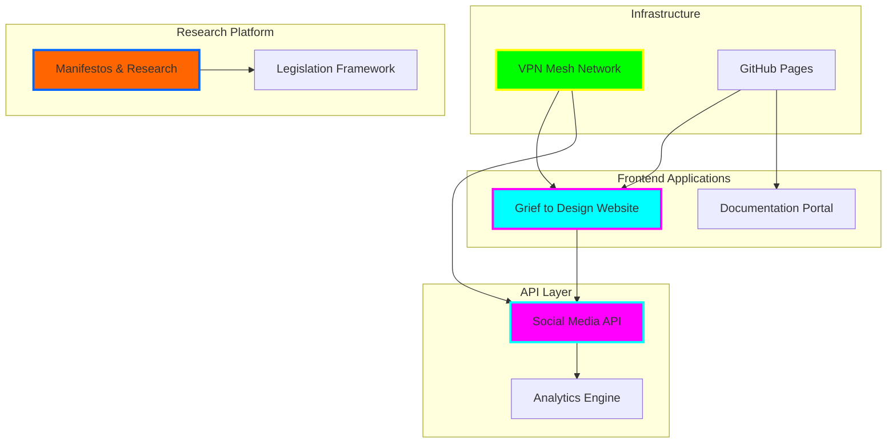

# tiation

<div align="center">


**🌟 Enterprise-Grade Monorepo Platform**

*React • TypeScript • Social Media Automation • Mesh Networking • Research Platform*


[](https://tiation.github.io/tiation)
[](https://tiation.github.io/tiation)
[](https://tiation.github.io/tiation/architecture)
[](https://github.com/tiation/tiation/tree/main/api/social-media)
[](https://github.com/tiation/tiation)
[](https://github.com/tiation/tiation/blob/main/LICENSE)

</div>

## 🚀 Overview

**Tiation** is a comprehensive enterprise-grade monorepo platform combining social media automation, advanced React applications, VPN mesh networking infrastructure, and cutting-edge research frameworks. Built with modern TypeScript, this platform delivers scalable solutions for automation, design innovation, and network infrastructure management.

> 🎯 **Mission**: Transform grief into design, automate social engagement, and build resilient network infrastructure through cooperative technology frameworks.

### ✨ Key Features

- 🎯 **Social Media Automation** - Advanced social media management with Twitter, LinkedIn, Facebook, Instagram, Reddit, and YouTube integration
- 🔧 **Grief to Design Platform** - Revolutionary React/TypeScript application for transforming grief into meaningful design solutions
- 🌟 **VPN Mesh Network** - Enterprise-grade mesh networking infrastructure with node discovery and monitoring
- 🛡️ **Research Platform** - Comprehensive research framework for cooperative capitalism and trust-first governance models

---

## 🏗️ Architecture

### System Architecture



### Technology Stack

- **Frontend**: React 18 + TypeScript + Vite + Tailwind CSS + shadcn/ui
- **Backend**: Node.js + Express + Social Media APIs
- **Database**: JSON-based data management + Analytics
- **Infrastructure**: Docker + Nginx + Mesh Networking + GitHub Pages
- **Monitoring**: Custom VPN mesh monitoring + Performance optimization
- **Package Management**: PNPM + Turbo (monorepo)
- **UI Components**: Radix UI + Lucide React + Chart.js

---

## 📋 Table of Contents

| Section | Description |
|---------|-------------|
| [✨ Features](#-features) | Core applications and technical capabilities |
| [🏃‍♂️ Quick Start](#%EF%B8%8F-quick-start) | Get up and running in minutes |
| [📦 Installation](#-installation) | Detailed setup instructions |
| [🎯 Usage](#-usage) | Examples and advanced configurations |
| [📚 Documentation](#-documentation) | Comprehensive guides and references |
| [📸 Screenshots](#-screenshots) | Visual overview of applications |
| [❓ FAQ](#-faq) | Common questions and troubleshooting |
| [🤝 Contributing](#-contributing) | How to contribute to the project |
| [🆘 Support](#-support) | Community and enterprise support options |
| [📄 License](#-license) | Legal information |
| [🌟 About Tiation](#-about-tiation) | Our mission and ecosystem |

---

## ✨ Features

### 🚀 Core Applications

- **Grief to Design Website**: React-based platform with advanced UI components, form handling, and responsive design
- **Social Media API**: Comprehensive automation suite supporting multiple platforms with analytics and scheduling
- **VPN Mesh Network**: Complete infrastructure solution with node management, security monitoring, and performance optimization
- **Documentation Portal**: Enterprise-grade documentation with GitHub Pages integration

### 🔧 Technical Features

- **Monorepo Architecture**: Turbo-powered workspace with efficient dependency management
- **Modern React Stack**: TypeScript, Vite, Tailwind CSS, and shadcn/ui component library
- **Social Media Integration**: Twitter, LinkedIn, Facebook, Instagram, Reddit, and YouTube APIs
- **Advanced Networking**: Mesh VPN infrastructure with real-time monitoring
- **Research Platform**: Comprehensive documentation and research management system

---

## 🏃‍♂️ Quick Start

```bash
# Clone the repository
git clone https://github.com/tiation/tiation.git
cd tiation

# Install dependencies
# Install PNPM (if not installed)
npm install -g pnpm

# Install dependencies
pnpm install

# Development mode
pnpm dev

# Run the application
# Development (all workspaces)
pnpm dev

# Build production
pnpm build

# Run specific app
pnpm --filter grief-to-design-website dev
```

---

## 📦 Installation

### Prerequisites

- **Node.js**: Version 18.0.0 or higher
- **PNPM**: Version 8.0.0 or higher
- **Git**: Latest version for repository management
- **Modern Browser**: Chrome, Firefox, Safari, or Edge
- **Social Media API Keys**: For social media integration features
- **Docker**: (Optional) For containerized deployment

### Installation Steps

1. **Clone the repository**
   ```bash
   git clone https://github.com/tiation/tiation.git
   cd tiation
   ```

2. **Install dependencies**
   ```bash
   # Install PNPM globally
npm install -g pnpm@8.10.0

# Install all dependencies
pnpm install

# Verify installation
pnpm --version
node --version
   ```

3. **Configuration**
   ```bash
   # Copy environment templates
cp api/social-media/.env.example api/social-media/.env

# Configure social media API keys (edit .env file)
# Set up mesh network configuration
cp infrastructure/vpn-mesh/node_config_templates/mesh-node.conf.example mesh-node.conf

# Initialize GitHub Pages (optional)
./setup-github-pages.sh
   ```

---

## 🎯 Usage

### Basic Usage

### Start Development Environment
```bash
# Start all applications
pnpm dev

# Access applications:
# - Grief to Design: http://localhost:5173
# - Social Media API: http://localhost:3000
# - Documentation: http://localhost:4000
```

### Build for Production
```bash
# Build all workspaces
pnpm build

# Deploy to GitHub Pages
pnpm deploy
```

### Advanced Usage

### Social Media Automation
```bash
# Configure social media profiles
node scripts/setup-social-profiles.js

# Launch Twitter bot
node api/social-media/scripts/twitter-launch.js

# Run analytics
node api/social-media/utils/analytics.js
```

### VPN Mesh Network
```bash
# Deploy mesh infrastructure
cd infrastructure/vpn-mesh
./scripts/setup-admin.sh

# Monitor network status
./scripts/mesh-tools/mesh-node-status
```

### Examples

### Example 1: Deploy Grief to Design Application
```bash
cd apps/grief-to-design-website
pnpm dev
# Visit http://localhost:5173 to see the application
```

### Example 2: Configure Social Media Integration
```bash
cd api/social-media
# Edit config.js with your API keys
node twitter-bot.js
```

### Example 3: Set Up Mesh Network Node
```bash
cd infrastructure/vpn-mesh
# Configure node settings
./scripts/add-client.sh your-node-name
```

---

## 📚 Documentation

- **[User Guide](docs/user-guide.md)** - Complete user documentation
- **[API Reference](docs/api-reference.md)** - Technical API documentation
- **[Architecture](docs/architecture.md)** - System architecture overview
- **[Deployment Guide](docs/deployment.md)** - Production deployment instructions
- **[Developer Guide](docs/developer-guide.md)** - Development setup and guidelines

### Live Documentation

Visit our [GitHub Pages site](https://tiation.github.io/tiation) for interactive documentation.

---

## 📸 Screenshots

<div align="center">
  
  <p><em>Main application interface</em></p>
</div>

<div align="center">
  
  <p><em>Analytics dashboard</em></p>
</div>

---

## ❓ FAQ

### General Questions

**Q: What makes this solution enterprise-grade?**
A: Our solution includes comprehensive security, scalability, monitoring, and enterprise integration features with professional support.

**Q: Is this compatible with existing systems?**
A: Yes, we provide extensive API and integration capabilities for seamless system integration.

**Q: What support options are available?**
A: We offer community support through GitHub Issues and professional enterprise support for commercial users.

### Technical Questions

**Q: What are the system requirements?**
A: Node.js 18+, PNPM 8+, 4GB RAM minimum, 10GB disk space. Docker optional for containerized deployment.

**Q: How do I handle large scale deployments?**
A: See our [Deployment Guide](docs/deployment.md) for enterprise-scale deployment strategies.

**Q: Are there any security considerations?**
A: Yes, please review our [Security Guide](docs/security.md) for comprehensive security best practices.

### Troubleshooting

**Q: Common installation issues**
A: Check our [Troubleshooting Guide](docs/troubleshooting.md) for solutions to common problems.

**Q: Performance optimization**
A: Refer to our [Performance Guide](docs/performance.md) for optimization strategies.

---

## 🤝 Contributing

We welcome contributions! Please see our [Contributing Guide](CONTRIBUTING.md) for details.

### Development Setup

1. Fork the repository
2. Create a feature branch
3. Make your changes
4. Add tests
5. Submit a pull request

### Code of Conduct

Please read our [Code of Conduct](CODE_OF_CONDUCT.md) before contributing.

---

## 🆘 Support

### Community Support

- **GitHub Issues**: [Report bugs or request features](https://github.com/tiation/tiation/issues)
- **Discussions**: [Join community discussions](https://github.com/tiation/tiation/discussions)
- **Documentation**: [Browse our documentation](https://tiation.github.io/tiation)

### Enterprise Support

For enterprise customers, we offer:
- Priority support
- Custom development
- Training and consultation
- SLA guarantees

Contact us at [tiatheone@protonmail.com](mailto:tiatheone@protonmail.com)

---

## 🔮 Tiation Ecosystem

This repository is part of the Tiation ecosystem. Explore related projects:

- [🌟 Tiation Platform](https://github.com/tiation/tiation-ai-platform) - Enterprise AI platform
- [🤖 AI Agents](https://github.com/tiation/tiation-ai-agents) - Intelligent automation
- [⚡ Terminal Workflows](https://github.com/tiation/tiation-terminal-workflows) - Developer tools
- [🐳 Docker Solutions](https://github.com/tiation/tiation-docker-debian) - Container orchestration
- [📝 CMS](https://github.com/tiation/tiation-cms) - Content management system
- [🐰 ChaseWhiteRabbit](https://github.com/ChaseWhiteRabbit/business) - Social impact organization
- [🏗️ Infrastructure](https://github.com/tiation/tiation-rigger-infrastructure) - Enterprise infrastructure

---

## 📄 License

This project is licensed under the MIT License - see the [LICENSE](LICENSE) file for details.

---

## 🌟 About Tiation

**Tiation** is a leading provider of enterprise-grade software solutions, specializing in automation, productivity, and system integration tools. Our mission is to empower organizations with cutting-edge technology that drives efficiency and innovation.

### Our Solutions

- **Automation Platform**: Comprehensive business process automation
- **Developer Tools**: Professional development and deployment tools
- **Enterprise Integration**: Seamless system integration solutions
- **Security Framework**: Advanced security and compliance tools

### Connect With Us

- **Website**: [https://github.com/tiation](https://github.com/tiation)
- **GitHub**: [https://github.com/tiation](https://github.com/tiation)
- **LinkedIn**: [Tiation Company](https://linkedin.com/company/tiation)
- **Twitter**: [@TiationTech](https://twitter.com/TiationTech)

---

<div align="center">
  <p>
    <strong>Built with ❤️ by the Tiation Team</strong>
  </p>
  <p>
    <a href="https://github.com/tiation">
      
    </a>
  </p>
</div>
