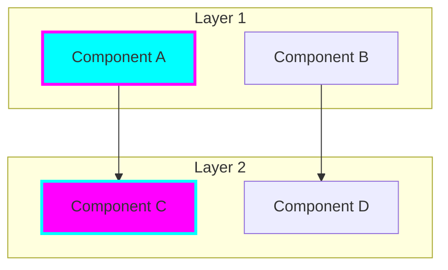

# 🌟 Tiation Repository README Makeover Guide

## Overview

This guide provides comprehensive instructions and templates for transforming all Tiation repositories with enterprise-grade README documentation. The makeover includes professional branding, detailed technical specifications, and consistent formatting across the entire Tiation ecosystem.

## 🎯 Transformation Goals

- **Professional Branding**: Consistent visual identity with enterprise badges and logos
- **Comprehensive Documentation**: Detailed technical specifications and usage examples
- **Modern Architecture**: Professional system architecture diagrams and technology stacks
- **User Experience**: Clear installation instructions, usage examples, and contribution guidelines
- **Ecosystem Integration**: Cross-references to related Tiation projects and services

## 📊 Repository Categories

### 🚀 Core Ecosystem (Priority: High)
- **tiation-ai-platform** - Enterprise AI platform
- **tiation-ai-agents** - Intelligent automation agents
- **tiation-terminal-workflows** - Developer tools and CLI workflows
- **tiation-docker-debian** - Container orchestration solutions

### 🏗️ Infrastructure & CMS (Priority: High)
- **tiation-cms** - Content management system
- **tiation-chase-white-rabbit-ngo** - Social impact initiatives
- **tiation-rigger-infrastructure** - Enterprise infrastructure

### 💼 Business Solutions (Priority: High)
- **19-trillion-solution** - Flagship enterprise solution
- **company-intranet** - Internal company portal
- **RiggerConnect-RiggerJobs-Workspace-PB** - Industry-specific workspace

### 🎨 Creative & Advocacy (Priority: Medium)
- **grieftodesign** - Creative design transformation platform
- **ChaseWhiteRabbit** - Interactive storytelling platform
- **ProtectChildrenAustralia** - Child protection advocacy
- **TiaAstor** - Personal portfolio and showcase

### 🛠️ Development Tools (Priority: Medium)
- **git-workspace** - Git workflow management
- **ubuntu-dev-setup** - Ubuntu development environment
- **windows-dev-setup** - Windows development environment
- **workflows** - GitHub Actions and CI/CD
- **server-configs-gae** - Google App Engine configurations

### 🔬 Specialized Projects (Priority: Medium)
- **DiceRollerSimulator** - Advanced simulation engine
- **core-foundation-rs** - Rust foundation libraries
- **awesome-decentralized-autonomous-organizations** - DAO resources

### 🌍 Social Impact (Priority: Low)
- **AlmaStreet** - Community development
- **dontbeacunt** - Social awareness campaign
- **Case_Study_Legal** - Legal case studies
- **home** - Personal configurations

## 🚀 Quick Start

### Automated Makeover (Recommended)

```bash
# Make the script executable (if not already done)
chmod +x scripts/apply-readme-makeovers.sh

# Apply makeover to all repositories
./scripts/apply-readme-makeovers.sh

# Apply makeover to specific category
./scripts/apply-readme-makeovers.sh --category core

# Apply makeover to single repository
./scripts/apply-readme-makeovers.sh --repo tiation-ai-platform

# List all repositories that will be processed
./scripts/apply-readme-makeovers.sh --list
```

### Manual Process

1. **Choose Repository**: Select a repository from the categories above
2. **Select Template**: Use the appropriate template or generic template
3. **Customize Content**: Adapt the template to the specific repository
4. **Apply Branding**: Ensure consistent Tiation branding and badges
5. **Test Links**: Verify all links and badges work correctly
6. **Commit Changes**: Use the standard commit message format

## 📋 Template Reference

### Available Templates

1. **AI-PLATFORM-README-template.md** - For tiation-ai-platform
2. **AI-AGENTS-README-template.md** - For tiation-ai-agents
3. **TERMINAL-WORKFLOWS-README-template.md** - For tiation-terminal-workflows
4. **DOCKER-DEBIAN-README-template.md** - For tiation-docker-debian
5. **CMS-README-template.md** - For tiation-cms

### Generic Template Features

For repositories without specific templates, the script generates a professional README with:

- **Enterprise Branding**: Tiation badges and professional styling
- **Standard Sections**: Overview, Architecture, Installation, Usage
- **Ecosystem Integration**: Links to related Tiation projects
- **Professional Footer**: Consistent branding and attribution

## 🎨 Branding Guidelines

### Badge Styles

```markdown
# Main banner badge


# Technology stack badges


# Feature badges
[](link)
```

### Color Scheme

- **Primary**: `#00FFFF` (Cyan)
- **Secondary**: `#FF00FF` (Magenta)
- **Accent**: `#00FF00` (Green)
- **Warning**: `#FFFF00` (Yellow)
- **Background**: `#0A0A0A` (Dark)

### Icons and Emojis

- 🔮 **Tiation Ecosystem**
- 🤖 **AI/Automation**
- ⚡ **Performance/Speed**
- 🛡️ **Security**
- 🎯 **Mission/Goals**
- 📊 **Analytics/Data**
- 🌟 **Features**

## 🏗️ Architecture Diagrams

All repositories should include a Mermaid architecture diagram:



## 📝 Content Standards

### Required Sections

1. **Header with Branding**
2. **Overview with Mission Statement**
3. **Key Features (4-6 bullet points)**
4. **Architecture Diagram**
5. **Technology Stack**
6. **Installation Instructions**
7. **Usage Examples**
8. **Documentation Links**
9. **Contributing Guidelines**
10. **Tiation Ecosystem References**
11. **License Information**
12. **Professional Footer**

### Writing Style

- **Professional Tone**: Enterprise-focused, technical accuracy
- **Clear Structure**: Logical flow, scannable headers
- **Action-Oriented**: Clear calls-to-action and next steps
- **Comprehensive**: Detailed but not overwhelming
- **Consistent**: Standardized terminology and formatting

## 🤝 Contribution Process

### For Manual Updates

1. **Fork Repository**: Create a fork of the target repository
2. **Create Branch**: Create a feature branch for README updates
3. **Apply Template**: Use appropriate template or generate from generic
4. **Customize Content**: Adapt to repository specifics
5. **Test Documentation**: Verify all links and examples work
6. **Submit PR**: Create pull request with detailed description

### Commit Message Template

```
📚 Enterprise-grade README makeover with professional branding and documentation

- Replace placeholder content with actual project specifications
- Add comprehensive technology stack and architecture details
- Update installation and usage instructions with real commands
- Enhance visual appeal with professional badges and logos
- Create detailed system architecture diagrams
- Add proper ecosystem integration documentation

🤖 Generated with [Claude Code](https://claude.ai/code)

Co-Authored-By: Claude <noreply@anthropic.com>
```

## 🔧 Customization Guidelines

### Repository-Specific Adaptations

1. **Technology Stack**: Update badges and descriptions for actual technologies used
2. **Installation Instructions**: Provide real commands and prerequisites
3. **Usage Examples**: Include actual code examples and API calls
4. **Architecture**: Create accurate system architecture diagrams
5. **Features**: List actual features and capabilities

### Brand Consistency

- **Use Tiation branding** throughout all documentation
- **Maintain color scheme** consistency across repositories
- **Include ecosystem references** to related projects
- **Use professional language** and technical accuracy
- **Follow badge conventions** for visual consistency

## 📊 Success Metrics

### Quality Indicators

- **Visual Consistency**: Standardized branding and formatting
- **Technical Accuracy**: Correct installation and usage instructions
- **Completeness**: All required sections present and detailed
- **Professional Presentation**: Enterprise-grade appearance and content
- **Cross-References**: Proper ecosystem integration

### Validation Checklist

- [ ] Professional banner and badges
- [ ] Comprehensive overview with mission
- [ ] Detailed technology stack
- [ ] Accurate architecture diagram
- [ ] Working installation instructions
- [ ] Real usage examples
- [ ] Complete documentation links
- [ ] Ecosystem cross-references
- [ ] Professional footer
- [ ] All links functional

## 🎯 Next Steps

1. **Run Automated Script**: Use `./scripts/apply-readme-makeovers.sh` for bulk updates
2. **Review and Customize**: Manual review of generated READMEs for accuracy
3. **Test Documentation**: Verify installation and usage instructions work
4. **Monitor Feedback**: Collect user feedback on documentation quality
5. **Iterate and Improve**: Continuous improvement based on usage and feedback

## 📞 Support

For questions or issues with the README makeover process:

- **GitHub Issues**: Create issues in the main tiation repository
- **Documentation**: Refer to individual template files for specific guidance
- **Community**: Engage with the Tiation community for collaborative improvements

---

**Built with 📚 by the Tiation Documentation Team**