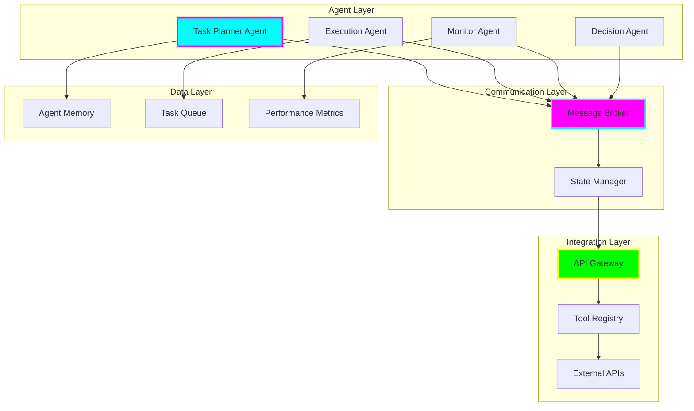

# tiation-ai-agents

<div align="center">


**🌟 Intelligent AI Agents & Autonomous Systems**

*Autonomous Agents • Task Automation • Multi-Agent Systems • Intelligent Workflows • Decision Making*


[](https://tiation.github.io/tiation-ai-agents)
[](https://tiation.github.io/tiation-ai-agents/docs)
[](https://tiation.github.io/tiation-ai-agents/architecture)
[](https://github.com/tiation/tiation-ai-agents/agents)
[](https://github.com/tiation/tiation-ai-agents)
[](https://github.com/tiation/tiation-ai-agents/blob/main/LICENSE)

</div>

## 🚀 Overview

**Tiation AI Agents** is an advanced intelligent automation platform featuring autonomous AI agents capable of complex task execution, decision-making, and multi-agent collaboration. Built with cutting-edge language models and modern Python frameworks, this platform enables sophisticated workflow automation and intelligent system orchestration.

> 🎯 **Mission**: Empower businesses with autonomous AI agents that intelligently automate complex workflows and decision-making processes.

### ✨ Key Features

- 🤖 **Autonomous Agents** - Self-directed AI agents with goal-oriented behavior and task planning
- 🔄 **Multi-Agent Systems** - Collaborative agent networks for complex problem-solving
- 🧠 **Intelligent Decision Making** - Advanced reasoning and contextual decision capabilities
- 📋 **Workflow Automation** - End-to-end business process automation with AI oversight
- 🔗 **API Integration** - Seamless integration with external services and tools
- 📊 **Performance Analytics** - Real-time monitoring and optimization of agent performance

---

## 🏗️ Architecture

### Multi-Agent System Architecture



### Technology Stack

- **AI/ML**: OpenAI GPT-4, Claude, LangChain, AutoGPT
- **Backend**: FastAPI, Python 3.9+, Celery, Redis
- **Database**: PostgreSQL, Redis, Vector Database
- **Message Queue**: RabbitMQ, Apache Kafka
- **Monitoring**: Prometheus, Grafana, Custom Analytics
- **Infrastructure**: Docker, Kubernetes, Terraform

---

## 📦 Installation

### Prerequisites

- **Python**: Version 3.9 or higher
- **OpenAI API Key**: For GPT-4 integration
- **Redis**: For caching and message brokering
- **Docker**: For containerized deployment
- **Memory**: 8GB RAM minimum, 16GB recommended

### Quick Start

```bash
# Clone the repository
git clone https://github.com/tiation/tiation-ai-agents.git
cd tiation-ai-agents

# Create virtual environment
python -m venv venv
source venv/bin/activate

# Install dependencies
pip install -r requirements.txt

# Configure environment
cp .env.example .env
# Edit .env with your API keys and configuration

# Initialize agents
python setup_agents.py

# Start the agent system
python main.py
```

---

## 🎯 Usage

### Basic Agent Creation

```python
from tiation_agents import Agent, AgentSystem

# Create a task automation agent
agent = Agent(
    name="TaskAutomator",
    role="Automate routine business tasks",
    tools=["email", "calendar", "slack"],
    llm="gpt-4"
)

# Initialize agent system
system = AgentSystem()
system.add_agent(agent)

# Assign task
task = system.create_task(
    description="Schedule weekly team meeting and send invites",
    priority="high"
)

# Execute task
result = system.execute_task(task)
```

### Multi-Agent Collaboration

```python
# Create collaborative agent team
planning_agent = Agent(name="Planner", role="task_planning")
execution_agent = Agent(name="Executor", role="task_execution")
monitor_agent = Agent(name="Monitor", role="quality_assurance")

# Create agent team
team = AgentTeam([planning_agent, execution_agent, monitor_agent])

# Complex task execution
complex_task = team.collaborate_on_task(
    "Analyze market data and create investment recommendations"
)
```

### Custom Agent Development

```python
from tiation_agents import BaseAgent

class CustomAnalysisAgent(BaseAgent):
    def __init__(self):
        super().__init__(
            name="DataAnalyst",
            capabilities=["data_analysis", "visualization", "reporting"]
        )
    
    def analyze_data(self, data_source):
        # Custom analysis logic
        return self.llm.process(f"Analyze this data: {data_source}")
    
    def generate_report(self, analysis):
        # Report generation logic
        return self.create_report(analysis)
```

---

## 🤖 Available Agents

### Core Agents

- **📋 Task Planner** - Intelligent task decomposition and planning
- **⚡ Execution Agent** - Autonomous task execution and completion
- **📊 Analytics Agent** - Data analysis and insight generation
- **📧 Communication Agent** - Email, chat, and notification management
- **🔍 Research Agent** - Web research and information gathering
- **📝 Content Agent** - Content creation and optimization

### Specialized Agents

- **💼 Business Process Agent** - Workflow automation and optimization
- **🛡️ Security Agent** - System monitoring and threat detection
- **💰 Finance Agent** - Financial analysis and reporting
- **📈 Marketing Agent** - Campaign management and optimization
- **🔧 DevOps Agent** - Infrastructure management and deployment
- **🎯 Quality Assurance Agent** - Testing and validation automation

---

## 📚 Documentation

- **[Agent Guide](docs/agent-guide.md)** - Complete agent development guide
- **[API Reference](docs/api-reference.md)** - Agent system API documentation  
- **[Multi-Agent Systems](docs/multi-agent.md)** - Collaborative agent patterns
- **[Deployment Guide](docs/deployment.md)** - Production deployment instructions
- **[Best Practices](docs/best-practices.md)** - Agent development best practices

---

## 🤝 Contributing

We welcome contributions! Please see our [Contributing Guide](CONTRIBUTING.md) for details.

### Development Setup

1. Fork the repository
2. Create a feature branch
3. Set up development environment with agents
4. Add tests for new agent capabilities
5. Submit a pull request

---

## 🔮 Tiation Ecosystem

This repository is part of the Tiation ecosystem:

- [🌟 Tiation Platform](https://github.com/tiation/tiation) - Main ecosystem platform
- [🤖 AI Platform](https://github.com/tiation/tiation-ai-platform) - Enterprise AI platform
- [⚡ Terminal Workflows](https://github.com/tiation/tiation-terminal-workflows) - Developer tools
- [🐳 Docker Solutions](https://github.com/tiation/tiation-docker-debian) - Container orchestration

---

## 📄 License

This project is licensed under the MIT License - see the [LICENSE](LICENSE) file for details.

---

<div align="center">
  <p>
    <strong>Built with ❤️ by the Tiation AI Team</strong>
  </p>
  <p>
    <a href="https://github.com/tiation">
      
    </a>
  </p>
</div>