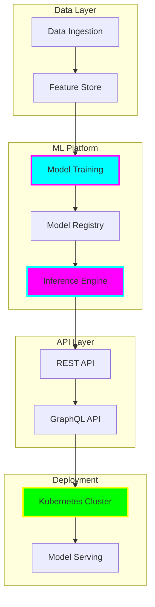

# tiation-ai-platform

<div align="center">


**🌟 Enterprise AI Platform & Intelligent Automation**

*Machine Learning • Natural Language Processing • Computer Vision • Deep Learning • MLOps*


[](https://tiation.github.io/tiation-ai-platform)
[](https://tiation.github.io/tiation-ai-platform/docs)
[](https://tiation.github.io/tiation-ai-platform/architecture)
[](https://github.com/tiation/tiation-ai-platform/models)
[](https://github.com/tiation/tiation-ai-platform)
[](https://github.com/tiation/tiation-ai-platform/blob/main/LICENSE)

</div>

## 🚀 Overview

**Tiation AI Platform** is a comprehensive enterprise-grade artificial intelligence platform providing cutting-edge machine learning capabilities, natural language processing, computer vision, and intelligent automation solutions. Built with modern Python frameworks and deployed on scalable cloud infrastructure, this platform delivers production-ready AI solutions for enterprise applications.

> 🎯 **Mission**: Democratize enterprise AI through scalable, intelligent automation and advanced machine learning capabilities.

### ✨ Key Features

- 🤖 **Machine Learning Pipeline** - End-to-end ML workflow with automated training, validation, and deployment
- 🧠 **Natural Language Processing** - Advanced text analysis, sentiment analysis, and language understanding
- 👁️ **Computer Vision** - Image recognition, object detection, and visual analytics capabilities  
- 🔄 **MLOps Integration** - Continuous integration and deployment for machine learning models
- 📊 **Analytics Dashboard** - Real-time monitoring and performance metrics for AI models
- 🛡️ **Enterprise Security** - Role-based access control and data privacy compliance

---

## 🏗️ Architecture

### System Architecture



### Technology Stack

- **ML Frameworks**: TensorFlow 2.x, PyTorch, Scikit-learn, XGBoost
- **Backend**: FastAPI, Python 3.9+, Celery, Redis
- **Database**: PostgreSQL, MongoDB, Vector Database (Pinecone/Weaviate)
- **Infrastructure**: Kubernetes, Docker, MLflow, Kubeflow
- **Monitoring**: Prometheus, Grafana, MLflow Tracking
- **Cloud**: AWS/GCP/Azure compatible, Terraform deployment

---

## 📦 Installation

### Prerequisites

- **Python**: Version 3.9 or higher
- **Docker**: Latest version for containerized deployment
- **Kubernetes**: For production deployment
- **GPU**: NVIDIA GPU with CUDA support (recommended)
- **Memory**: 16GB RAM minimum, 32GB recommended

### Quick Start

```bash
# Clone the repository
git clone https://github.com/tiation/tiation-ai-platform.git
cd tiation-ai-platform

# Create virtual environment
python -m venv venv
source venv/bin/activate  # On Windows: venv\Scripts\activate

# Install dependencies
pip install -r requirements.txt

# Initialize the platform
python setup.py install

# Start development server
python app.py
```

---

## 🎯 Usage

### Basic Usage

```python
from tiation_ai import AIплатform

# Initialize the platform
platform = AIPlatform(config='config.yml')

# Train a model
model = platform.train_model(
    data_path='data/training.csv',
    model_type='classification',
    target='target_column'
)

# Deploy model
platform.deploy_model(model, endpoint='prediction-api')
```

### Advanced Usage

```python
# Custom model pipeline
pipeline = platform.create_pipeline([
    'data_preprocessing',
    'feature_engineering', 
    'model_training',
    'model_validation',
    'deployment'
])

# Run pipeline
pipeline.execute()

# Monitor model performance
metrics = platform.get_model_metrics('model-id-123')
```

---

## 🤝 Contributing

We welcome contributions! Please see our [Contributing Guide](CONTRIBUTING.md) for details.

### Development Setup

1. Fork the repository
2. Create a feature branch
3. Set up development environment
4. Add tests for new features
5. Submit a pull request

---

## 📚 Documentation

- **[User Guide](docs/user-guide.md)** - Complete platform documentation  
- **[API Reference](docs/api-reference.md)** - REST and GraphQL API documentation
- **[Model Documentation](docs/models.md)** - Available ML models and usage
- **[Deployment Guide](docs/deployment.md)** - Kubernetes and cloud deployment
- **[Developer Guide](docs/developer-guide.md)** - Development setup and guidelines

---

## 🔮 Tiation Ecosystem

This repository is part of the Tiation ecosystem:

- [🌟 Tiation Platform](https://github.com/tiation/tiation) - Main ecosystem platform
- [🤖 AI Agents](https://github.com/tiation/tiation-ai-agents) - Intelligent automation agents  
- [⚡ Terminal Workflows](https://github.com/tiation/tiation-terminal-workflows) - Developer tools
- [🐳 Docker Solutions](https://github.com/tiation/tiation-docker-debian) - Container orchestration

---

## 📄 License

This project is licensed under the MIT License - see the [LICENSE](LICENSE) file for details.

---

<div align="center">
  <p>
    <strong>Built with ❤️ by the Tiation AI Team</strong>
  </p>
  <p>
    <a href="https://github.com/tiation">
      
    </a>
  </p>
</div>