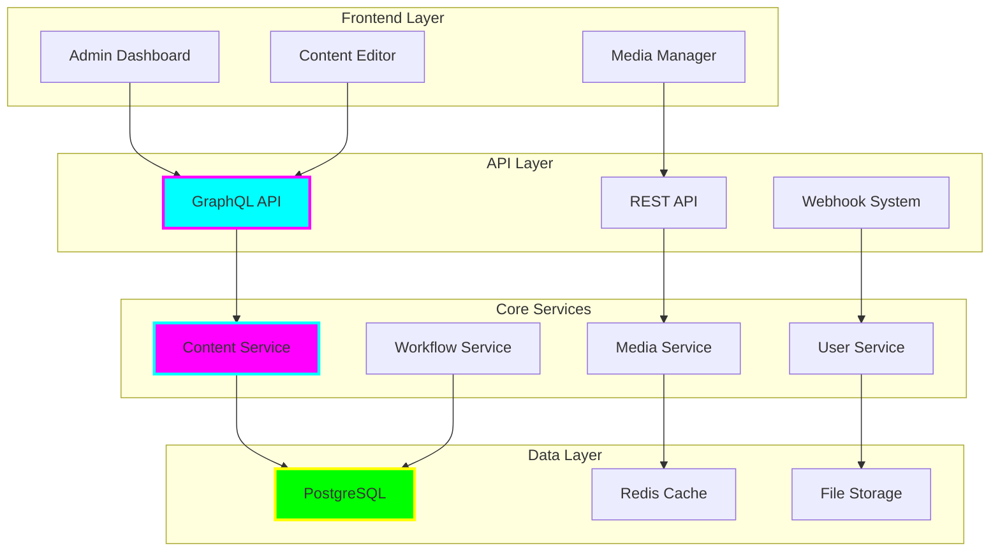

# tiation-cms

<div align="center">


**🌟 Enterprise Content Management System**

*Headless CMS • Content Creation • API-First • Multi-Channel Publishing • Modern Architecture*


[](https://tiation.github.io/tiation-cms)
[](https://tiation.github.io/tiation-cms/docs)
[](https://tiation.github.io/tiation-cms/architecture)
[](https://github.com/tiation/tiation-cms/api)
[](https://github.com/tiation/tiation-cms)
[](https://github.com/tiation/tiation-cms/blob/main/LICENSE)

</div>

## 🚀 Overview

**Tiation CMS** is a modern, enterprise-grade headless content management system built with React, Node.js, and GraphQL. Designed for scalability and flexibility, it provides powerful content creation tools, API-first architecture, and seamless multi-channel publishing capabilities for modern digital experiences.

> 🎯 **Mission**: Empower content creators with intuitive tools while providing developers with flexible APIs for building exceptional digital experiences.

### ✨ Key Features

- 📝 **Intuitive Content Editor** - Rich text editing with drag-and-drop functionality and media management
- 🔗 **Headless Architecture** - API-first design for maximum flexibility and multi-platform support
- 📊 **Dynamic Content Models** - Flexible content types and custom field definitions
- 🔄 **Multi-Channel Publishing** - Publish content across websites, mobile apps, and third-party platforms
- 👥 **Collaboration Tools** - Team collaboration, workflows, and approval processes
- 🛡️ **Enterprise Security** - Role-based permissions, audit logging, and data encryption

---

## 🏗️ Architecture

### Headless CMS Architecture



### Technology Stack

- **Frontend**: React 18, TypeScript, Material-UI, TinyMCE
- **Backend**: Node.js, Express, GraphQL, Apollo Server
- **Database**: PostgreSQL, Redis, Elasticsearch (search)
- **File Storage**: AWS S3, Cloudinary, Local filesystem
- **Authentication**: JWT, OAuth2, SAML integration
- **Infrastructure**: Docker, Kubernetes, Nginx, PM2

---

## 📦 Installation

### Prerequisites

- **Node.js**: Version 18.0 or higher
- **PostgreSQL**: Version 14 or higher
- **Redis**: Latest version for caching
- **Storage**: AWS S3 or compatible service (optional)
- **Memory**: 4GB RAM minimum, 8GB recommended

### Quick Start

```bash
# Clone the repository
git clone https://github.com/tiation/tiation-cms.git
cd tiation-cms

# Install dependencies
npm install

# Set up environment variables
cp .env.example .env
# Edit .env with your database and service configurations

# Run database migrations
npm run migrate

# Seed initial data
npm run seed

# Start development server
npm run dev
```

### Docker Installation

```bash
# Using Docker Compose
docker-compose up -d

# Access the CMS at http://localhost:3000
# Default admin credentials: admin@tiation.com / admin123
```

---

## 🎯 Usage

### Content Management

```javascript
// Create a new content type
const contentType = await cms.createContentType({
  name: 'Blog Post',
  fields: [
    { name: 'title', type: 'string', required: true },
    { name: 'content', type: 'rich_text', required: true },
    { name: 'author', type: 'relation', target: 'User' },
    { name: 'tags', type: 'array', items: 'string' },
    { name: 'published', type: 'boolean', default: false }
  ]
});

// Create content
const blogPost = await cms.create('blog-post', {
  title: 'Getting Started with Tiation CMS',
  content: '<p>Welcome to our amazing CMS...</p>',
  author: 'user-123',
  tags: ['tutorial', 'cms', 'getting-started'],
  published: true
});
```

### GraphQL API Usage

```graphql
# Fetch blog posts
query GetBlogPosts {
  blogPosts(limit: 10, where: { published: true }) {
    id
    title
    content
    author {
      name
      email
    }
    tags
    createdAt
    updatedAt
  }
}

# Create new blog post
mutation CreateBlogPost($data: BlogPostInput!) {
  createBlogPost(data: $data) {
    id
    title
    slug
    published
  }
}
```

### REST API Usage

```javascript
// Fetch content via REST API
const response = await fetch('/api/content/blog-posts?published=true');
const blogPosts = await response.json();

// Create content via REST API
const newPost = await fetch('/api/content/blog-posts', {
  method: 'POST',
  headers: { 'Content-Type': 'application/json' },
  body: JSON.stringify({
    title: 'New Blog Post',
    content: 'Post content...',
    published: false
  })
});
```

---

## 📝 Content Features

### Content Types

- **📰 Articles** - Blog posts, news articles, and editorial content
- **📄 Pages** - Static pages and landing pages
- **📸 Media** - Images, videos, documents, and file management
- **👥 Users** - Author profiles and user management
- **🏷️ Categories** - Content organization and taxonomy
- **💬 Comments** - User-generated content and moderation

### Advanced Features

- **🔍 Full-Text Search** - Elasticsearch integration for powerful search
- **📱 Responsive Preview** - Preview content across different devices
- **⏰ Scheduled Publishing** - Schedule content for future publication
- **🌍 Internationalization** - Multi-language content support
- **📊 Analytics** - Content performance and user engagement metrics
- **🔄 Version Control** - Content versioning and revision history

---

## 🛠️ Customization

### Custom Fields

```javascript
// Register custom field type
cms.registerField('location', {
  component: LocationPicker,
  validator: (value) => {
    return value.latitude && value.longitude;
  },
  serialize: (value) => JSON.stringify(value),
  deserialize: (value) => JSON.parse(value)
});
```

### Custom Widgets

```jsx
// Create custom content widget
const CustomWidget = ({ content, config }) => {
  return (
    <div className="custom-widget">
      <h3>{content.title}</h3>
      <p>{content.description}</p>
    </div>
  );
};

cms.registerWidget('custom-widget', CustomWidget);
```

### Hooks and Plugins

```javascript
// Register lifecycle hooks
cms.beforeCreate('blog-post', async (data, context) => {
  // Generate slug from title
  data.slug = slugify(data.title);
  
  // Set default author
  if (!data.author) {
    data.author = context.user.id;
  }
});

cms.afterUpdate('blog-post', async (data, context) => {
  // Invalidate cache
  await cache.invalidate(`blog-post-${data.id}`);
  
  // Send notification
  await notification.send('content-updated', data);
});
```

---

## 🚀 Deployment

### Production Deployment

```bash
# Build for production
npm run build

# Start production server
npm run start

# Using PM2
pm2 start ecosystem.config.js

# Health check
curl http://localhost:3000/health
```

### Kubernetes Deployment

```yaml
apiVersion: apps/v1
kind: Deployment
metadata:
  name: tiation-cms
spec:
  replicas: 3
  selector:
    matchLabels:
      app: tiation-cms
  template:
    metadata:
      labels:
        app: tiation-cms
    spec:
      containers:
      - name: cms
        image: tiation/cms:latest
        ports:
        - containerPort: 3000
        env:
        - name: DATABASE_URL
          valueFrom:
            secretKeyRef:
              name: cms-secrets
              key: database-url
        - name: REDIS_URL
          valueFrom:
            secretKeyRef:
              name: cms-secrets
              key: redis-url
```

---

## 📚 Documentation

- **[User Guide](docs/user-guide.md)** - Complete CMS user documentation
- **[API Reference](docs/api-reference.md)** - GraphQL and REST API documentation
- **[Content Modeling](docs/content-modeling.md)** - Creating custom content types
- **[Deployment Guide](docs/deployment.md)** - Production deployment instructions
- **[Plugin Development](docs/plugins.md)** - Creating custom plugins and extensions

---

## 🤝 Contributing

We welcome contributions! Please see our [Contributing Guide](CONTRIBUTING.md) for details.

### Development Setup

1. Fork the repository
2. Create a feature branch
3. Set up development environment
4. Add tests for new features
5. Submit a pull request

---

## 🔮 Tiation Ecosystem

This repository is part of the Tiation ecosystem:

- [🌟 Tiation Platform](https://github.com/tiation/tiation) - Main ecosystem platform
- [🤖 AI Platform](https://github.com/tiation/tiation-ai-platform) - Enterprise AI platform
- [🤖 AI Agents](https://github.com/tiation/tiation-ai-agents) - Intelligent automation
- [⚡ Terminal Workflows](https://github.com/tiation/tiation-terminal-workflows) - Developer tools

---

## 📄 License

This project is licensed under the MIT License - see the [LICENSE](LICENSE) file for details.

---

<div align="center">
  <p>
    <strong>Built with 📝 by the Tiation Content Team</strong>
  </p>
  <p>
    <a href="https://github.com/tiation">
      
    </a>
  </p>
</div>