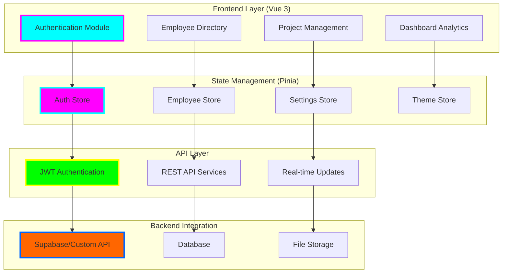

# company-intranet

<div align="center">


**🌟 Modern Enterprise Intranet Portal**

*Vue 3 • TypeScript • Employee Management • Project Collaboration • Real-time Dashboard*


[](https://tiation.github.io/company-intranet)
[](https://tiation.github.io/company-intranet/docs)
[](https://tiation.github.io/company-intranet/architecture)
[](https://github.com/tiation/company-intranet/features)
[](https://github.com/tiation/company-intranet)
[](https://github.com/tiation/company-intranet/blob/main/LICENSE)

</div>

## 🚀 Overview

**Tiation Company Intranet** is a modern, enterprise-grade intranet portal built with Vue 3, TypeScript, and cutting-edge web technologies. This comprehensive solution provides employee directory management, project collaboration tools, department organization, and real-time dashboards designed to streamline internal business operations and enhance team productivity.

> 🎯 **Mission**: Create a unified digital workplace that connects teams, streamlines workflows, and empowers employees with intuitive, modern tools for maximum productivity.

### ✨ Key Features

- 👥 **Employee Directory** - Comprehensive employee management with advanced search, filtering, and profile management
- 📊 **Real-time Dashboard** - Executive dashboards with metrics, project overviews, and company-wide statistics
- 🏗️ **Project Management** - Integrated project tracking, collaboration tools, and progress monitoring
- 🏢 **Department Organization** - Structured department management with hierarchical organization
- 🔐 **Secure Authentication** - JWT-based authentication with role-based access control (RBAC)
- 🎨 **Modern UI/UX** - Responsive design with dark/light themes and professional aesthetics

---

## 🏗️ Architecture

### Enterprise Application Architecture



### Technology Stack

- **Frontend**: Vue 3 (Composition API), TypeScript, Vite, Vue Router 4
- **Styling**: Tailwind CSS 3, PostCSS, Responsive Design
- **State Management**: Pinia (Modern Vuex alternative)
- **Authentication**: JWT tokens, Role-based access control
- **Backend Ready**: Supabase integration, REST API services
- **Development**: ESLint, Prettier, Hot Module Replacement
- **Deployment**: GitHub Actions, GitHub Pages, Docker ready

---

## 📦 Installation

### Prerequisites

- **Node.js**: Version 18.0 or higher
- **npm/yarn/pnpm**: Latest package manager
- **Git**: For version control
- **Modern Browser**: Chrome, Firefox, Safari, Edge
- **Backend API**: Supabase account or custom API endpoint

### Quick Start

```bash
# Clone the repository
git clone https://github.com/tiation/company-intranet.git
cd company-intranet

# Install dependencies
npm install

# Set up environment variables
cp .env.example .env
# Edit .env with your configuration

# Start development server
npm run dev

# Access the application at http://localhost:5173
```

### Environment Configuration

```bash
# Application Settings
VITE_APP_NAME="Company Intranet"
VITE_APP_VERSION="1.0.0"
VITE_API_BASE_URL="http://localhost:3000/api"

# Company Branding
VITE_COMPANY_NAME="Tiation"
VITE_COMPANY_TAGLINE="Innovative Digital Solutions"
VITE_COMPANY_DESCRIPTION="Empowering teams to collaborate and innovate"

# Backend Integration
VITE_SUPABASE_URL="your-supabase-project-url"
VITE_SUPABASE_ANON_KEY="your-supabase-anon-key"
```

---

## 🎯 Usage

### Demo Credentials

The application includes demo data for testing:

```bash
# Administrator Access
Email: admin@company.com
Password: password123

# Standard User Access
Email: user@company.com
Password: password123
```

### Core Functionality

#### Employee Directory Management
```javascript
// Employee search and filtering
const employees = useEmployeeStore()

// Search employees
await employees.searchEmployees('john doe')

// Filter by department
await employees.filterByDepartment('Engineering')

// Update employee profile
await employees.updateEmployee(employeeId, profileData)
```

#### Project Management Integration
```javascript
// Project tracking
const projects = useProjectStore()

// Create new project
await projects.createProject({
  name: 'Website Redesign',
  description: 'Complete company website overhaul',
  department: 'Design',
  deadline: '2024-12-31'
})

// Assign team members
await projects.assignMembers(projectId, memberIds)
```

#### Dashboard Analytics
```javascript
// Real-time dashboard data
const dashboard = useDashboardStore()

// Get company metrics
const metrics = await dashboard.getCompanyMetrics()
// Returns: { totalEmployees, activeProjects, completedTasks, revenue }

// Department performance
const performance = await dashboard.getDepartmentPerformance()
```

---

## 🏢 Enterprise Features

### Authentication & Security

- **JWT Authentication**: Secure token-based authentication system
- **Role-Based Access Control**: Admin, Manager, Employee access levels
- **Session Management**: Persistent sessions with secure logout
- **Password Security**: Encrypted password storage and validation
- **Route Protection**: Protected routes based on user permissions

### Employee Management

- **Comprehensive Profiles**: Full employee information with photos and contact details
- **Advanced Search**: Multi-criteria search across all employee data
- **Department Organization**: Hierarchical department structure with managers
- **Skills Tracking**: Employee skills and competency management
- **Performance Integration**: Ready for performance review system integration

### Project Collaboration

- **Project Dashboard**: Visual project tracking with progress indicators
- **Team Assignment**: Flexible team member assignment and role management
- **Task Management**: Integrated task creation and tracking
- **Timeline Views**: Project timelines with milestone tracking
- **File Sharing**: Document and file sharing capabilities

### Analytics & Reporting

- **Executive Dashboard**: High-level company metrics and KPIs
- **Department Analytics**: Department-specific performance metrics
- **Employee Analytics**: Individual and team performance tracking
- **Custom Reports**: Configurable reporting system
- **Export Functions**: CSV and PDF export capabilities

---

## 🎨 Customization

### Theme Configuration

```javascript
// tailwind.config.js - Custom company branding
module.exports = {
  theme: {
    extend: {
      colors: {
        primary: {
          50: '#f0f9ff',
          500: '#06b6d4',
          900: '#164e63'
        },
        company: {
          blue: '#00FFFF',
          purple: '#FF00FF',
          dark: '#0A0A0A'
        }
      }
    }
  }
}
```

### Company Branding

```vue
<!-- src/components/layout/Header.vue -->
<template>
  <header class="bg-white border-b border-gray-200">
    <div class="flex items-center justify-between px-6 py-4">
      <div class="flex items-center">
        
        <h1 class="ml-3 text-xl font-semibold text-gray-900">
          {{ companyName }}
        </h1>
      </div>
    </div>
  </header>
</template>
```

### Custom Components

```vue
<!-- src/components/custom/CompanyMetrics.vue -->
<template>
  <div class="grid grid-cols-1 md:grid-cols-4 gap-6">
    <MetricCard
      v-for="metric in metrics"
      :key="metric.name"
      :title="metric.name"
      :value="metric.value"
      :change="metric.change"
      :icon="metric.icon"
    />
  </div>
</template>
```

---

## 🚀 Deployment

### Production Build

```bash
# Build for production
npm run build

# Preview production build
npm run preview

# Deploy to GitHub Pages
npm run deploy
```

### Docker Deployment

```dockerfile
# Dockerfile
FROM node:18-alpine as builder
WORKDIR /app
COPY package*.json ./
RUN npm ci --only=production
COPY . .
RUN npm run build

FROM nginx:alpine
COPY --from=builder /app/dist /usr/share/nginx/html
COPY nginx.conf /etc/nginx/nginx.conf
EXPOSE 80
CMD ["nginx", "-g", "daemon off;"]
```

### Environment-Specific Deployment

```bash
# Development environment
npm run build:dev

# Staging environment
npm run build:staging

# Production environment
npm run build:prod
```

---

## 🔌 API Integration

### Backend Setup

The intranet is designed to integrate with various backend solutions:

#### Supabase Integration
```javascript
// src/services/supabase.js
import { createClient } from '@supabase/supabase-js'

const supabaseUrl = import.meta.env.VITE_SUPABASE_URL
const supabaseKey = import.meta.env.VITE_SUPABASE_ANON_KEY

export const supabase = createClient(supabaseUrl, supabaseKey)
```

#### Custom API Integration
```javascript
// src/services/api.js
const API_BASE_URL = import.meta.env.VITE_API_BASE_URL

export const apiClient = {
  async get(endpoint) {
    const response = await fetch(`${API_BASE_URL}${endpoint}`, {
      headers: {
        'Authorization': `Bearer ${getToken()}`,
        'Content-Type': 'application/json'
      }
    })
    return response.json()
  }
}
```

### Database Schema

```sql
-- Employee table structure
CREATE TABLE employees (
  id UUID PRIMARY KEY DEFAULT uuid_generate_v4(),
  email VARCHAR(255) UNIQUE NOT NULL,
  first_name VARCHAR(100) NOT NULL,
  last_name VARCHAR(100) NOT NULL,
  department_id UUID REFERENCES departments(id),
  role VARCHAR(100),
  hire_date DATE,
  avatar_url TEXT,
  created_at TIMESTAMP DEFAULT NOW()
);

-- Projects table structure
CREATE TABLE projects (
  id UUID PRIMARY KEY DEFAULT uuid_generate_v4(),
  name VARCHAR(255) NOT NULL,
  description TEXT,
  status VARCHAR(50) DEFAULT 'active',
  start_date DATE,
  end_date DATE,
  department_id UUID REFERENCES departments(id),
  created_at TIMESTAMP DEFAULT NOW()
);
```

---

## 🧪 Testing

### Development Testing

```bash
# Run unit tests
npm run test

# Run end-to-end tests
npm run test:e2e

# Run tests with coverage
npm run test:coverage
```

### Testing Configuration

```javascript
// vitest.config.js
export default {
  test: {
    environment: 'jsdom',
    setupFiles: ['./src/test/setup.js'],
    coverage: {
      reporter: ['text', 'html', 'json'],
      threshold: {
        global: {
          branches: 80,
          functions: 80,
          lines: 80,
          statements: 80
        }
      }
    }
  }
}
```

---

## 📚 Documentation

- **[User Guide](docs/user-guide.md)** - Complete user documentation for employees
- **[Admin Guide](docs/admin-guide.md)** - Administrative features and management
- **[API Documentation](docs/api.md)** - Backend integration and API endpoints
- **[Deployment Guide](docs/deployment.md)** - Production deployment instructions
- **[Customization Guide](docs/customization.md)** - Branding and feature customization

### Live Documentation

Visit our [GitHub Pages documentation](https://tiation.github.io/company-intranet) for interactive guides and tutorials.

---

## 🤝 Contributing

We welcome contributions! Please see our [Contributing Guide](CONTRIBUTING.md) for details.

### Development Setup

1. Fork the repository
2. Create a feature branch
3. Set up development environment
4. Add tests for new features
5. Submit a pull request

### Code Standards

```bash
# Format code
npm run format

# Lint code
npm run lint

# Type check
npm run type-check
```

---

## 🔮 Tiation Ecosystem

This repository is part of the Tiation ecosystem:

- [🌟 Tiation Platform](https://github.com/tiation/tiation) - Main ecosystem platform
- [🤖 AI Platform](https://github.com/tiation/tiation-ai-platform) - Enterprise AI platform
- [🤖 AI Agents](https://github.com/tiation/tiation-ai-agents) - Intelligent automation
- [⚡ Terminal Workflows](https://github.com/tiation/tiation-terminal-workflows) - Developer tools
- [🐳 Docker Solutions](https://github.com/tiation/tiation-docker-debian) - Container orchestration

---

## 📄 License

This project is licensed under the MIT License - see the [LICENSE](LICENSE) file for details.

---

<div align="center">
  <p>
    <strong>Built with 🏢 by the Tiation Enterprise Team</strong>
  </p>
  <p>
    <a href="https://github.com/tiation">
      
    </a>
  </p>
</div>