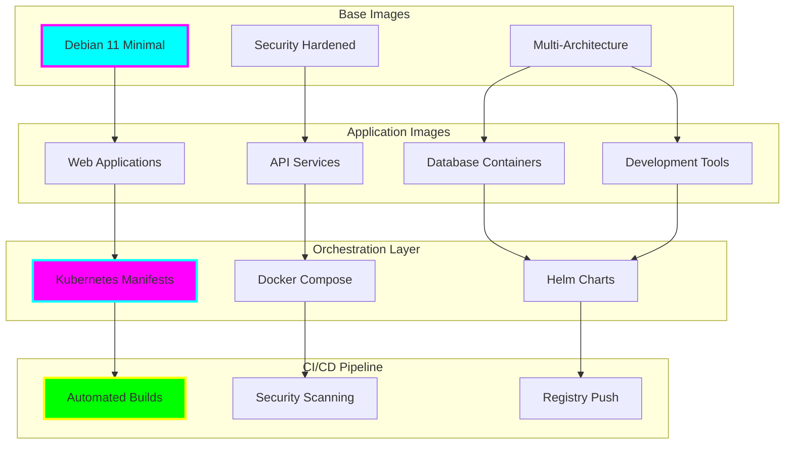

# tiation-docker-debian

<div align="center">


**🌟 Enterprise Docker Solutions & Container Orchestration**

*Docker Containers • Debian Base Images • Container Orchestration • DevOps Automation • Production Ready*


[](https://hub.docker.com/r/tiation/debian)
[](https://tiation.github.io/tiation-docker-debian/docs)
[](https://tiation.github.io/tiation-docker-debian/architecture)
[](https://github.com/tiation/tiation-docker-debian/images)
[](https://github.com/tiation/tiation-docker-debian)
[](https://github.com/tiation/tiation-docker-debian/blob/main/LICENSE)

</div>

## 🚀 Overview

**Tiation Docker Debian** provides enterprise-grade Docker container solutions built on optimized Debian base images. This repository offers a comprehensive collection of production-ready container images, orchestration templates, and deployment automation tools designed for scalable infrastructure management and modern DevOps workflows.

> 🎯 **Mission**: Deliver secure, optimized, and production-ready container solutions for enterprise infrastructure and application deployment.

### ✨ Key Features

- 🐳 **Optimized Base Images** - Lightweight, secure Debian-based container images
- 🔒 **Security Hardened** - CVE scanning, minimal attack surface, security best practices
- 📦 **Multi-Architecture** - Support for AMD64, ARM64, and ARM32 architectures
- 🚀 **Production Ready** - Battle-tested images with comprehensive monitoring and logging
- 🔄 **Automated Updates** - Regular security updates and dependency management
- 🛠️ **Development Tools** - Complete development environment containers

---

## 🏗️ Architecture

### Container Orchestration Architecture



### Technology Stack

- **Base OS**: Debian 11 (Bullseye) Minimal Installation
- **Container Runtime**: Docker 20.10+, Podman, containerd
- **Orchestration**: Kubernetes 1.24+, Docker Swarm, Docker Compose
- **Security**: Trivy, Clair, Docker Security Scanning
- **CI/CD**: GitHub Actions, GitLab CI, Jenkins
- **Registry**: Docker Hub, AWS ECR, Google GCR, Azure ACR

---

## 📦 Installation

### Prerequisites

- **Docker**: Version 20.10 or higher
- **Docker Compose**: Version 2.0+ (optional)
- **Kubernetes**: Version 1.24+ (for orchestration)
- **System**: Linux, macOS, or Windows with WSL2

### Quick Start

```bash
# Pull the base Debian image
docker pull tiation/debian:11-minimal

# Run a container
docker run -it tiation/debian:11-minimal bash

# Using Docker Compose
curl -O https://raw.githubusercontent.com/tiation/tiation-docker-debian/main/examples/docker-compose.yml
docker-compose up -d
```

### Available Images

```bash
# Base images
docker pull tiation/debian:11-minimal          # Minimal Debian 11 base
docker pull tiation/debian:11-security        # Security hardened version
docker pull tiation/debian:11-dev            # Development tools included

# Application-specific images
docker pull tiation/debian:node-18           # Node.js 18 on Debian
docker pull tiation/debian:python-3.11       # Python 3.11 on Debian
docker pull tiation/debian:nginx             # Optimized Nginx server
docker pull tiation/debian:postgresql        # PostgreSQL database
```

---

## 🎯 Usage

### Basic Container Usage

```bash
# Run interactive Debian container
docker run -it tiation/debian:11-minimal

# Run with mounted volume
docker run -v $(pwd):/workspace tiation/debian:11-dev

# Run as daemon with port mapping
docker run -d -p 8080:80 tiation/debian:nginx
```

### Development Environment

```bash
# Start complete development stack
docker-compose -f dev-stack.yml up -d

# Access development container
docker exec -it dev-container bash

# Run tests in container
docker run --rm -v $(pwd):/app tiation/debian:node-18 npm test
```

### Production Deployment

```yaml
# docker-compose.prod.yml
version: '3.8'
services:
  web:
    image: tiation/debian:nginx
    ports:
      - "80:80"
      - "443:443"
    volumes:
      - ./nginx.conf:/etc/nginx/nginx.conf
      - ./ssl:/etc/nginx/ssl
    restart: unless-stopped

  api:
    image: tiation/debian:node-18
    environment:
      - NODE_ENV=production
    depends_on:
      - database
    restart: unless-stopped

  database:
    image: tiation/debian:postgresql
    environment:
      - POSTGRES_DB=myapp
      - POSTGRES_PASSWORD=${DB_PASSWORD}
    volumes:
      - db_data:/var/lib/postgresql/data
    restart: unless-stopped

volumes:
  db_data:
```

---

## 🐳 Container Images

### Base Images

| Image | Size | Description | Architecture |
|-------|------|-------------|--------------|
| `tiation/debian:11-minimal` | ~100MB | Minimal Debian 11 base | amd64, arm64 |
| `tiation/debian:11-security` | ~120MB | Security hardened base | amd64, arm64 |
| `tiation/debian:11-dev` | ~500MB | Development tools included | amd64, arm64 |

### Runtime Images

| Image | Size | Description | Use Case |
|-------|------|-------------|----------|
| `tiation/debian:node-18` | ~200MB | Node.js 18 runtime | Web applications, APIs |
| `tiation/debian:python-3.11` | ~180MB | Python 3.11 runtime | Data science, web services |
| `tiation/debian:nginx` | ~150MB | Optimized Nginx | Web server, reverse proxy |
| `tiation/debian:postgresql` | ~250MB | PostgreSQL database | Data persistence |

### Development Images

| Image | Size | Description | Tools Included |
|-------|------|-------------|----------------|
| `tiation/debian:full-dev` | ~1GB | Complete dev environment | Git, Docker, kubectl, terraform |
| `tiation/debian:web-dev` | ~600MB | Web development | Node.js, npm, yarn, git |
| `tiation/debian:data-dev` | ~800MB | Data science | Python, R, Jupyter, pandas |

---

## 🔧 Customization

### Building Custom Images

```dockerfile
# Dockerfile.custom
FROM tiation/debian:11-minimal

# Install additional packages
RUN apt-get update && apt-get install -y \
    curl \
    vim \
    htop \
    && rm -rf /var/lib/apt/lists/*

# Add custom configuration
COPY config/ /etc/myapp/

# Set working directory
WORKDIR /app

# Default command
CMD ["bash"]
```

### Multi-stage Build Example

```dockerfile
# Build stage
FROM tiation/debian:node-18 AS builder
WORKDIR /app
COPY package*.json ./
RUN npm ci --only=production

# Production stage
FROM tiation/debian:11-minimal
RUN apt-get update && apt-get install -y nodejs npm
WORKDIR /app
COPY --from=builder /app/node_modules ./node_modules
COPY . .
EXPOSE 3000
CMD ["node", "server.js"]
```

---

## 🚀 Kubernetes Integration

### Deployment Example

```yaml
apiVersion: apps/v1
kind: Deployment
metadata:
  name: web-app
spec:
  replicas: 3
  selector:
    matchLabels:
      app: web-app
  template:
    metadata:
      labels:
        app: web-app
    spec:
      containers:
      - name: web
        image: tiation/debian:nginx
        ports:
        - containerPort: 80
        resources:
          requests:
            memory: "128Mi"
            cpu: "100m"
          limits:
            memory: "256Mi"
            cpu: "200m"
---
apiVersion: v1
kind: Service
metadata:
  name: web-service
spec:
  selector:
    app: web-app
  ports:
  - port: 80
    targetPort: 80
  type: LoadBalancer
```

---

## 📚 Documentation

- **[Container Guide](docs/containers.md)** - Complete container usage guide
- **[Image Reference](docs/images.md)** - Available images and their specifications
- **[Security Guide](docs/security.md)** - Container security best practices
- **[Orchestration](docs/orchestration.md)** - Kubernetes and Docker Compose examples
- **[CI/CD Integration](docs/cicd.md)** - Automated deployment workflows

---

## 🤝 Contributing

We welcome contributions! Please see our [Contributing Guide](CONTRIBUTING.md) for details.

### Development Setup

1. Fork the repository
2. Create a feature branch
3. Build and test container images
4. Add documentation for new images
5. Submit a pull request

### Building Images Locally

```bash
# Clone the repository
git clone https://github.com/tiation/tiation-docker-debian.git
cd tiation-docker-debian

# Build base image
docker build -f images/debian-minimal/Dockerfile -t tiation/debian:11-minimal .

# Build all images
./scripts/build-all.sh

# Test images
./scripts/test-images.sh
```

---

## 🔮 Tiation Ecosystem

This repository is part of the Tiation ecosystem:

- [🌟 Tiation Platform](https://github.com/tiation/tiation) - Main ecosystem platform
- [🤖 AI Platform](https://github.com/tiation/tiation-ai-platform) - Enterprise AI platform
- [🤖 AI Agents](https://github.com/tiation/tiation-ai-agents) - Intelligent automation
- [⚡ Terminal Workflows](https://github.com/tiation/tiation-terminal-workflows) - Developer tools

---

## 📄 License

This project is licensed under the MIT License - see the [LICENSE](LICENSE) file for details.

---

<div align="center">
  <p>
    <strong>Built with 🐳 by the Tiation Infrastructure Team</strong>
  </p>
  <p>
    <a href="https://github.com/tiation">
      
    </a>
  </p>
</div>