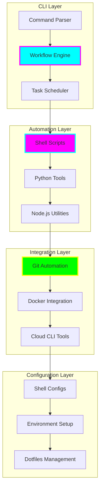

# tiation-terminal-workflows

<div align="center">


**🌟 Advanced Terminal Workflows & Developer Tools**

*CLI Automation • Shell Scripts • Developer Productivity • Terminal Enhancement • Workflow Orchestration*


[](https://tiation.github.io/tiation-terminal-workflows)
[](https://tiation.github.io/tiation-terminal-workflows/docs)
[](https://github.com/tiation/tiation-terminal-workflows/scripts)
[](https://github.com/tiation/tiation-terminal-workflows/tools)
[](https://github.com/tiation/tiation-terminal-workflows)
[](https://github.com/tiation/tiation-terminal-workflows/blob/main/LICENSE)

</div>

## 🚀 Overview

**Tiation Terminal Workflows** is a comprehensive collection of advanced terminal workflows, CLI tools, and developer productivity enhancements. This repository provides powerful automation scripts, shell enhancements, and workflow orchestration tools designed to maximize developer efficiency and streamline complex terminal operations.

> 🎯 **Mission**: Supercharge developer productivity through intelligent terminal automation and advanced CLI workflow orchestration.

### ✨ Key Features

- ⚡ **Smart CLI Tools** - Intelligent command-line utilities with advanced functionality
- 🔄 **Workflow Automation** - Complex multi-step workflow orchestration and execution
- 🛠️ **Development Shortcuts** - Rapid development environment setup and management
- 📊 **Terminal Analytics** - Usage statistics and performance monitoring for workflows
- 🔧 **Shell Enhancements** - Advanced shell configurations and productivity boosters
- 🎨 **Terminal Theming** - Beautiful and functional terminal themes and configurations

---

## 🏗️ Architecture

### Workflow Orchestration Architecture



### Technology Stack

- **Shell Scripting**: Bash, Zsh, Fish, PowerShell
- **CLI Tools**: Python Click/Typer, Node.js Commander
- **Automation**: GitHub Actions, GitLab CI, Jenkins
- **Package Managers**: Homebrew, APT, Chocolatey, npm
- **Terminal Enhancement**: Oh My Zsh, Starship, Tmux
- **Cloud Tools**: AWS CLI, Azure CLI, GCP CLI, Terraform

---

## 📦 Installation

### Prerequisites

- **Shell**: Bash 4.0+, Zsh 5.0+, or Fish 3.0+
- **Python**: Version 3.8+ (for Python-based tools)
- **Node.js**: Version 16+ (for Node.js utilities)
- **Git**: Latest version for repository operations
- **Package Manager**: Homebrew (macOS), APT (Ubuntu), or Chocolatey (Windows)

### Quick Install

```bash
# Clone the repository
git clone https://github.com/tiation/tiation-terminal-workflows.git
cd tiation-terminal-workflows

# Run the installation script
./install.sh

# Source your shell configuration
source ~/.zshrc  # or ~/.bashrc

# Verify installation
tiation-cli --version
```

### Manual Installation

```bash
# Install CLI tools
pip install -r requirements.txt
npm install -g @tiation/terminal-tools

# Set up shell configurations
./setup/shell-setup.sh

# Install additional tools
./setup/tools-install.sh
```

---

## 🎯 Usage

### Basic Commands

```bash
# Initialize a new project with complete setup
tiation init myproject --type=react --git --docker

# Quick environment setup
tiation env setup --language=python --tools=docker,git,vscode

# Automated deployment workflow
tiation deploy --environment=staging --notify=slack

# Bulk repository operations
tiation repo sync --all --push --status
```

### Advanced Workflows

```bash
# Multi-repository management
tiation workspace create --repos="repo1,repo2,repo3" --sync
tiation workspace status --detailed --format=table

# Automated testing pipeline
tiation test run --parallel --coverage --report=html
tiation test watch --on-change --notify

# Development environment orchestration
tiation dev start --services=db,redis,api --logs
tiation dev reset --clean --seed-data
```

### Custom Workflow Creation

```yaml
# .tiation/workflows/deploy.yml
name: "Full Stack Deployment"
description: "Complete deployment workflow"
steps:
  - name: "Build Frontend"
    command: "npm run build"
    working_dir: "./frontend"
  
  - name: "Build Backend"
    command: "docker build -t api:latest ."
    working_dir: "./backend"
  
  - name: "Deploy to Staging"
    command: "kubectl apply -f k8s/staging/"
    
  - name: "Run Health Checks"
    command: "curl -f https://staging.api.com/health"
    retry: 3
```

---

## 🛠️ Available Tools

### Core CLI Tools

- **🚀 Project Initializer** - `tiation init` - Complete project setup with templates
- **🔄 Workflow Runner** - `tiation run` - Execute complex multi-step workflows
- **📊 Repository Manager** - `tiation repo` - Bulk repository operations and management
- **🛠️ Environment Setup** - `tiation env` - Development environment configuration
- **📦 Package Manager** - `tiation pkg` - Universal package management interface
- **🔧 Configuration Manager** - `tiation config` - Centralized configuration management

### Automation Scripts

- **Git Automation** - Automated branching, merging, and release workflows
- **Docker Management** - Container lifecycle management and orchestration
- **Database Operations** - Schema migrations, backups, and data seeding
- **CI/CD Integration** - Pipeline triggers and deployment automation
- **Performance Monitoring** - System resource monitoring and alerting
- **Backup & Sync** - Automated backup and synchronization workflows

### Shell Enhancements

- **Smart Aliases** - Intelligent command aliases with context awareness
- **Auto-completion** - Advanced tab completion for custom commands
- **Terminal Themes** - Beautiful and functional terminal themes
- **Productivity Functions** - Time-saving shell functions and shortcuts
- **Environment Variables** - Centralized environment variable management
- **History Management** - Enhanced command history with search and analytics

---

## 📚 Documentation

- **[CLI Reference](docs/cli-reference.md)** - Complete command-line interface documentation
- **[Workflow Guide](docs/workflows.md)** - Creating and managing custom workflows
- **[Shell Setup](docs/shell-setup.md)** - Advanced shell configuration guide
- **[Automation Scripts](docs/automation.md)** - Available automation scripts and usage
- **[Custom Tools](docs/custom-tools.md)** - Building custom CLI tools and extensions

---

## 🤝 Contributing

We welcome contributions! Please see our [Contributing Guide](CONTRIBUTING.md) for details.

### Development Setup

1. Fork the repository
2. Create a feature branch
3. Set up development environment
4. Add tests for new tools/workflows
5. Submit a pull request

### Adding New Tools

```bash
# Create new tool template
./scripts/create-tool.sh my-new-tool

# Edit the generated template
# tools/my-new-tool/main.py or main.sh

# Test the tool
./scripts/test-tool.sh my-new-tool

# Add documentation
# docs/tools/my-new-tool.md
```

---

## 🔮 Tiation Ecosystem

This repository is part of the Tiation ecosystem:

- [🌟 Tiation Platform](https://github.com/tiation/tiation) - Main ecosystem platform
- [🤖 AI Platform](https://github.com/tiation/tiation-ai-platform) - Enterprise AI platform
- [🤖 AI Agents](https://github.com/tiation/tiation-ai-agents) - Intelligent automation
- [🐳 Docker Solutions](https://github.com/tiation/tiation-docker-debian) - Container orchestration

---

## 📄 License

This project is licensed under the MIT License - see the [LICENSE](LICENSE) file for details.

---

<div align="center">
  <p>
    <strong>Built with ⚡ by the Tiation Developer Tools Team</strong>
  </p>
  <p>
    <a href="https://github.com/tiation">
      
    </a>
  </p>
</div>